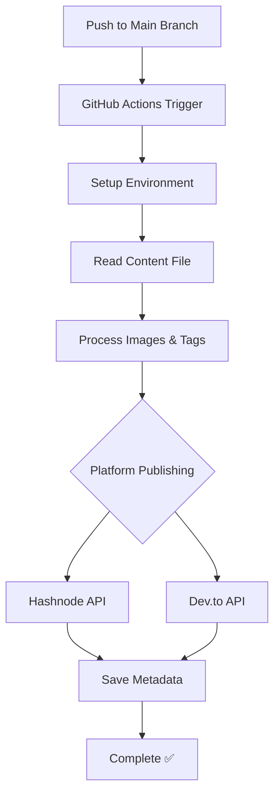

# Article Automation Test Repository

**🚀 [GitHub Actions](https://github.com/features/actions) • 📚 [Hashnode](https://hashnode.com) • 📝 [Dev.to](https://dev.to) • 📄 MIT License**

🧪 **Test repository demonstrating the multi-platform blog publishing system**

This repository serves as a **demonstration and testing ground** for the [article-automation](https://github.com/gokulnathan66/article-automation) GitHub Actions that automatically publish content to Hashnode and Dev.to platforms.

## 📑 Table of Contents

- [🎯 Purpose](#-purpose)
- [⚡ Quick Start](#-quick-start)
- [📋 Prerequisites](#-prerequisites)
- [📁 Repository Structure](#-repository-structure)
- [📝 Test Content](#-test-content)
- [🔄 How It Works](#-how-it-works)
- [📥 Installation](#-installation)
- [⚙️ Workflow Configuration](#️-workflow-configuration)
- [🔐 Required Secrets](#-required-secrets)
- [🎮 Testing the System](#-testing-the-system)
- [📊 Execution Process](#-execution-process)
- [🔧 Debugging & Troubleshooting](#-debugging--troubleshooting)
- [📈 Expected Results](#-expected-results)
- [🎯 Use Cases](#-use-cases)
- [🤝 Contributing](#-contributing)
- [📄 License](#-license)
- [🔗 Related Links](#-related-links)

## 🎯 Purpose

This repository demonstrates:
- ✅ How to structure content for automated publishing
- ✅ Proper workflow configuration
- ✅ Integration with multiple blogging platforms
- ✅ Automated image URL conversion
- ✅ Post update functionality

## ⚡ Quick Start

**Estimated setup time: 15-20 minutes**

### ✅ Quick Start Checklist

1. **Fork this repository** (2 min)
2. **Get API keys** from Hashnode and Dev.to (5-10 min)
3. **Configure secrets** in repository settings (3-5 min)
4. **Test the workflow** with sample content (2-3 min)

> 💡 **First time?** Follow the detailed [Installation](#-installation) section below.

## 📋 Prerequisites

Before setting up the automation, ensure you have:

### 🔐 Account Requirements
- **GitHub account** with repository admin access
- **Hashnode account** with a publication (free tier supported)
- **Dev.to account** with API access enabled

### 📝 Content Requirements
- Articles written in **Markdown format**
- Images hosted on GitHub or external CDN
- Basic understanding of **GitHub Actions**

### 🛠️ Technical Requirements
- **No local setup required** - runs entirely on GitHub Actions
- Compatible with **public and private repositories**
- Supports **automated and manual triggers**

### 📊 Platform Limits
| Platform | Rate Limits | Notes |
|----------|-------------|-------|
| **Hashnode** | 100 requests/hour | GraphQL API |
| **Dev.to** | 30 requests/30 seconds | REST API |
| **GitHub Actions** | 2,000 minutes/month (free) | Ubuntu runners |

## 📁 Repository Structure

```
article-automation-test/
├── 📁 content/
│   └── 📄 README.md              # Your article content (required)
├── 📁 images/                    # Referenced images (optional)
│   ├── 🖼️ demo-screenshot.png
│   └── 🖼️ feature-diagram.jpg
├── 📁 .github/workflows/
│   ├── ⚙️ devto.yml             # Dev.to publishing workflow
│   ├── ⚙️ hashnode.yml          # Hashnode publishing workflow
│   └── ⚙️ publish.yml           # Combined workflow (recommended)
├── 📄 .gitignore                # Git ignore rules
├── 📄 LICENSE                   # MIT license
└── 📄 README.md                 # This documentation
```

### 📋 File Descriptions

| File/Folder | Purpose | Required |
|-------------|---------|----------|
| `content/README.md` | Your article content in Markdown | ✅ **Required** |
| `images/` | Static images referenced in articles | ❌ Optional |
| `.github/workflows/` | GitHub Actions automation | ✅ **Required** |
| `.gitignore` | Excludes temporary files | ✅ **Recommended** |
| `LICENSE` | Project license | ✅ **Recommended** |

## 📝 Test Content

The test article in `content/README.md` should follow this structure:

### 📋 Content Format Requirements

```markdown
# Your Article Title

Your article introduction goes here. This will become the description.

## Section Headers

Use standard markdown formatting:

- **Bold text** for emphasis
- *Italic text* for subtle emphasis
- `inline code` for technical terms
- [links](https://example.com) to external resources

### Code Blocks

```javascript
// Your code examples
function example() {
    return "Hello World!";
}
```

### Images


<!-- Will be converted to: https://raw.githubusercontent.com/username/repo/main/images/screenshot.png -->

---

**Tags:** javascript, tutorial, automation, github-actions
```

### ⚠️ **Platform Compatibility Notes**

| Feature | GitHub | Hashnode | Dev.to | Alternative |
|---------|--------|----------|--------|-------------|
| **HTML Badges** | ✅ Supported | ✅ Supported | ❌ Not supported | Use text alternatives |
| **HTML Tags** | ✅ Most supported | ✅ Most supported | ❌ Markdown only | Use markdown equivalents |
| **Custom CSS** | ✅ In repos | ❌ Limited | ❌ Not supported | Use standard formatting |
| **Tables** | ✅ Supported | ✅ Supported | ✅ Supported | ✅ Safe to use |
| **Code Blocks** | ✅ Supported | ✅ Supported | ✅ Supported | ✅ Safe to use |
| **Emojis** | ✅ Supported | ✅ Supported | ✅ Supported | ✅ Safe to use |

> 💡 **Tip**: When writing content for multi-platform publishing, stick to standard Markdown to ensure compatibility across GitHub, Hashnode, and Dev.to.

### ✅ Content Validation Checklist

- [ ] Title starts with `#` (becomes post title)
- [ ] Images use relative paths (`./images/file.png`)
- [ ] Tags listed at bottom (`**Tags:** tag1, tag2, tag3`)
- [ ] Proper markdown formatting throughout
- [ ] No HTML tags (use markdown equivalents)
- [ ] External links include `https://`

## 🔄 How It Works

When content is pushed to the `main` branch:

1. **GitHub Actions Trigger**: The workflow in `.github/workflows/publish.yml` runs
2. **Content Processing**: Actions read `content/README.md`
3. **Image URL Conversion**: Relative image paths → GitHub raw URLs
4. **Multi-Platform Publishing**:
   - **Hashnode**: Uses GraphQL API to publish/update
   - **Dev.to**: Uses REST API to publish/update
5. **State Management**: Saves post IDs for future updates

## 📥 Installation

> **⚠️ Important**: This is a test repository. To use the automation in your own projects, follow these detailed steps:

### 🍴 Step 1: Fork Repository (2 minutes)

1. **Click "Fork"** button at the top of this repository
2. **Choose your account** as the destination
3. **Keep the same name** or customize it
4. **Ensure "Copy the main branch only"** is checked

### 🔑 Step 2: Get API Keys (5-10 minutes)

#### **Hashnode API Key**
1. Go to [Hashnode Settings](https://hashnode.com/settings/developer)
2. Click **"Generate New Token"**
3. **Copy the PAT** (Personal Access Token)
4. **Find your Publication ID**:
   - Go to your publication dashboard
   - Copy the ID from the URL or settings

#### **Dev.to API Key**
1. Visit [Dev.to API Keys](https://dev.to/settings/extensions)
2. **Generate new API key**
3. **Copy the key** (starts with `dto_`)

#### **GitHub Token**
1. Go to [GitHub Token Settings](https://github.com/settings/tokens?type=beta)
2. **Create fine-grained token** for your repository
3. **Select permissions**:
   - ✅ `Contents: Read and Write`
   - ✅ `Actions: Write`
   - ✅ `Variables: Write`

### 🔐 Step 3: Configure Secrets (3-5 minutes)

1. **Go to your forked repository**
2. **Click Settings** → **Secrets and variables** → **Actions**
3. **Add the following secrets**:

```bash
# Required for Hashnode
HASHNODE_PAT=hn_pat_your_token_here
HASHNODE_PUBLICATION_ID=your_publication_id
HASHNODE_PUBLICATION_HOST=yourblog.hashnode.dev

# Required for Dev.to
DEV_TO_API_KEY=dto_your_api_key_here

# Required for both
VAR_EDIT_TOKEN_GIT=github_pat_your_token_here
```

### 📝 Step 4: Test the Setup (2-3 minutes)

1. **Edit `content/README.md`** with your test article
2. **Commit and push** to main branch
3. **Go to Actions tab** to watch the workflow
4. **Check your platforms** for published articles

> 💡 **Pro tip**: Start with a simple test article to verify everything works before publishing your main content.

## ⚙️ Workflow Configuration

### 📋 Available Workflow Options

Choose the configuration that best fits your needs:

#### 🚀 **Option 1: Combined Workflow** (Recommended)

Create `.github/workflows/publish.yml`:

```yaml
name: Multi-Platform Publishing

on:
  push:
    branches: [main]
    paths: ['content/**'] # Only trigger on content changes
  workflow_dispatch:
    inputs:
      platform:
        description: 'Platform to publish to'
        required: false
        default: 'both'
        type: choice
        options:
          - both
          - hashnode
          - devto

jobs:
  validate-content:
    runs-on: ubuntu-latest
    outputs:
      has-content: ${{ steps.check.outputs.has-content }}
    steps:
      - name: Checkout repository
        uses: actions/checkout@v4
        
      - name: Check if content exists
        id: check
        run: |
          if [ -f "content/README.md" ] && [ -s "content/README.md" ]; then
            echo "has-content=true" >> $GITHUB_OUTPUT
          else
            echo "has-content=false" >> $GITHUB_OUTPUT
            echo "❌ No content found in content/README.md"
            exit 1
          fi

  publish-hashnode:
    needs: validate-content
    if: needs.validate-content.outputs.has-content == 'true' && (github.event.inputs.platform == 'hashnode' || github.event.inputs.platform == 'both' || github.event.inputs.platform == '')
    runs-on: ubuntu-latest
    steps:
      - name: Checkout repository
        uses: actions/checkout@v4
        
      - name: Validate Hashnode secrets
        run: |
          if [ -z "${{ secrets.HASHNODE_PAT }}" ]; then
            echo "❌ HASHNODE_PAT secret is missing"
            exit 1
          fi
          if [ -z "${{ secrets.HASHNODE_PUBLICATION_ID }}" ]; then
            echo "❌ HASHNODE_PUBLICATION_ID secret is missing"
            exit 1
          fi
        
      - name: Publish to Hashnode
        uses: gokulnathan66/article-automation/hashnode-publish@main
        with:
          hashnode-pat: ${{ secrets.HASHNODE_PAT }}
          hashnode-publication-id: ${{ secrets.HASHNODE_PUBLICATION_ID }}
          hashnode-publication-host: ${{ secrets.HASHNODE_PUBLICATION_HOST }}
          github-token: ${{ secrets.VAR_EDIT_TOKEN_GIT }}
          # State management variables
          saved-post-id: ${{ vars.HASHNODE_SAVED_POST_ID }}
          saved-post-slug: ${{ vars.HASHNODE_SAVED_POST_SLUG }}
          saved-post-title: ${{ vars.HASHNODE_SAVED_POST_TITLE }}
          saved-post-url: ${{ vars.HASHNODE_SAVED_POST_URL }}
          saved-post-published-at: ${{ vars.HASHNODE_SAVED_POST_PUBLISHED_AT }}
          saved-post-updated-at: ${{ vars.HASHNODE_SAVED_POST_UPDATED_AT }}

  publish-devto:
    needs: validate-content
    if: needs.validate-content.outputs.has-content == 'true' && (github.event.inputs.platform == 'devto' || github.event.inputs.platform == 'both' || github.event.inputs.platform == '')
    runs-on: ubuntu-latest
    steps:
      - name: Checkout repository
        uses: actions/checkout@v4
        
      - name: Validate Dev.to secrets
        run: |
          if [ -z "${{ secrets.DEV_TO_API_KEY }}" ]; then
            echo "❌ DEV_TO_API_KEY secret is missing"
            exit 1
          fi
        
      - name: Publish to Dev.to
        uses: gokulnathan66/article-automation/devto-publish@main
        with:
          devto-api-key: ${{ secrets.DEV_TO_API_KEY }}
          github-token: ${{ secrets.VAR_EDIT_TOKEN_GIT }}
          # State management variables
          saved-post-id: ${{ vars.DEV_TO_SAVED_POST_ID }}
          saved-post-title: ${{ vars.DEV_TO_SAVED_POST_TITLE }}
          saved-post-url: ${{ vars.DEV_TO_SAVED_POST_URL }}
          saved-post-published-at: ${{ vars.DEV_TO_SAVED_POST_PUBLISHED_AT }}
          saved-post-updated-at: ${{ vars.DEV_TO_SAVED_POST_UPDATED_AT }}
```

#### 🔧 **Option 2: Separate Workflows**

For more granular control, create separate workflow files:

**`.github/workflows/hashnode.yml`** and **`.github/workflows/devto.yml`**

### ⚙️ **Workflow Features**

| Feature | Description | Benefit |
|---------|-------------|---------|
| **Content Validation** | Checks if content exists before publishing | Prevents empty posts |
| **Secret Validation** | Verifies all required secrets are configured | Early error detection |
| **Manual Triggers** | Allows publishing to specific platforms | Testing flexibility |
| **Path Filtering** | Only runs when content changes | Saves CI minutes |
| **State Management** | Tracks published posts for updates | Smart update logic |

## 🔐 Required Secrets

> ⚠️ **Important**: Configure these secrets in your repository before running the automation.

Navigate to **Repository Settings → Secrets and variables → Actions** and add:

### 🌐 Hashnode Integration
| Secret Name | Description | How to Get |
|-------------|-------------|------------|
| `HASHNODE_PAT` | Personal Access Token | [Hashnode Settings](https://hashnode.com/settings) → API |
| `HASHNODE_PUBLICATION_ID` | Your publication ID | Found in publication settings |
| `HASHNODE_PUBLICATION_HOST` | Publication domain | e.g., `mysite.hashnode.dev` |

### 📝 Dev.to Integration
| Secret Name | Description | How to Get |
|-------------|-------------|------------|
| `DEV_TO_API_KEY` | API key from Dev.to | [Dev.to Settings](https://dev.to/settings/extensions) |

### 🔧 GitHub Integration
| Secret Name | Description | Scopes Required |
|-------------|-------------|-----------------|
| `VAR_EDIT_TOKEN_GIT` | GitHub Personal Access Token | `repo`, `actions:write` |

> 💡 **Tip**: Create a [fine-grained personal access token](https://github.com/settings/tokens?type=beta) for better security.

## 🎮 Testing the System

### Option 1: Manual Trigger
1. Go to **Actions** tab in this repository
2. Select **"Multi-Platform Publishing"** workflow
3. Click **"Run workflow"**
4. Watch the execution in real-time

### Option 2: Content Update
1. Edit `content/README.md`
2. Commit and push to `main` branch
3. Workflow triggers automatically
4. Check the Actions tab for execution logs

### Option 3: Fork and Test
1. Fork this repository
2. Configure your own secrets
3. Update `content/README.md` with your content
4. Push changes to see it published to your platforms

## 📊 Execution Process



### 🔄 **Phase 1: Setup**
- ✅ Checkout action repository
- ✅ Setup Node.js environment  
- ✅ Install dependencies

### 📝 **Phase 2: Content Processing**
- 🔍 Locate `content/README.md` file
- 📝 Extract title from first `# heading`
- 🖼️ Convert relative image URLs to GitHub raw URLs
- 🏷️ Parse tags from `Tags:` line at the end

### 🚀 **Phase 3: Platform Publishing**
- **Hashnode**: GraphQL API calls for publish/update
- **Dev.to**: REST API calls for publish/update  
- 🔍 Check for existing posts by title
- ✅ Create new or update existing post

### 💾 **Phase 4: State Management**
- 💾 Save post IDs to repository variables
- 📊 Store metadata for future updates
- ✅ Enable smart update functionality

## 🔧 Debugging & Troubleshooting

### 🔍 **Common Issues & Solutions**

#### ❌ **Workflow Fails to Start**

**Problem**: Workflow doesn't trigger on push
```bash
# Check these common causes:
```

| Issue | Solution | Prevention |
|-------|----------|------------|
| No workflow file | Create `.github/workflows/publish.yml` | Use provided templates |
| Wrong branch | Push to `main` branch | Check workflow `branches:` setting |
| Missing content | Add content to `content/README.md` | Validate content exists |
| Disabled Actions | Enable Actions in repository settings | Check Settings → Actions |

#### 🔑 **Authentication Errors**

**Problem**: `401 Unauthorized` or `403 Forbidden`

```yaml
# Common secret validation errors
Error: Request failed with status code 401
Error: Invalid API key format
Error: Token expired or revoked
```

**Solutions**:
1. **Verify secret names match exactly**:
   ```bash
   # Required secrets (case-sensitive):
   HASHNODE_PAT
   HASHNODE_PUBLICATION_ID
   HASHNODE_PUBLICATION_HOST
   DEV_TO_API_KEY
   VAR_EDIT_TOKEN_GIT
   ```

2. **Check token permissions**:
   - **Hashnode**: Ensure PAT has publication access
   - **Dev.to**: Verify API key is not expired
   - **GitHub**: Token needs `Contents: Write`, `Actions: Write`, `Variables: Write`

3. **Test tokens manually**:
   ```bash
   # Test Hashnode token
   curl -H "Authorization: Bearer YOUR_PAT" \
        -H "Content-Type: application/json" \
        -d '{"query":"{ me { id username } }"}' \
        https://gql.hashnode.com/

   # Test Dev.to token
   curl -H "api-key: YOUR_API_KEY" \
        https://dev.to/api/articles/me
   ```

#### 📝 **Content Processing Errors**

**Problem**: Article not parsed correctly

| Error Type | Common Cause | Fix |
|------------|--------------|-----|
| **No title found** | Missing `# Title` at start | Add `# Your Title` as first line |
| **Images not converted** | Wrong image path format | Use `./images/file.png` format |
| **Tags not detected** | Wrong tag format | Use `**Tags:** tag1, tag2, tag3` |
| **Content too long** | Article exceeds platform limits | Check platform limits below |

#### 📊 **Platform-Specific Limits**

| Platform | Title Limit | Content Limit | Tags Limit | Image Size |
|----------|-------------|---------------|------------|------------|
| **Hashnode** | 255 chars | ~65,000 chars | 5 tags max | 10MB |
| **Dev.to** | 128 chars | ~64,000 chars | 4 tags max | 25MB |

#### 🔄 **State Management Issues**

**Problem**: Posts duplicated instead of updated

```bash
# Check repository variables
Settings → Secrets and variables → Actions → Variables tab

# Required variables (auto-created):
HASHNODE_SAVED_POST_ID
HASHNODE_SAVED_POST_SLUG
DEV_TO_SAVED_POST_ID
```

**Solution**: Variables are created automatically after first successful publish. If missing:
1. Delete and recreate the post manually
2. Or run workflow again (it will create new post and set variables)

### 📋 **Debugging Checklist**

When workflow fails, check in this order:

1. **✅ Repository Setup**
   - [ ] Workflow file exists in `.github/workflows/`
   - [ ] Content file exists at `content/README.md`
   - [ ] Content is not empty
   - [ ] Pushing to `main` branch

2. **✅ Secrets Configuration**
   - [ ] All required secrets are added
   - [ ] Secret names match exactly (case-sensitive)
   - [ ] No extra spaces in secret values
   - [ ] Tokens are not expired

3. **✅ Content Format**
   - [ ] Title starts with `#`
   - [ ] Images use relative paths (`./images/`)
   - [ ] Tags format: `**Tags:** tag1, tag2`
   - [ ] No HTML tags used

4. **✅ Platform Accounts**
   - [ ] Hashnode publication exists and is accessible
   - [ ] Dev.to account has API access enabled
   - [ ] GitHub token has correct repository permissions

### 🔍 **How to Read Logs**

1. **Go to Actions tab** in your repository
2. **Click the failed workflow run**
3. **Click the failed job** (e.g., "publish-hashnode")
4. **Expand each step** to see detailed output
5. **Look for red ❌ errors** and yellow ⚠️ warnings

### 📞 **Getting Help**

If you're still stuck:

1. **Check existing issues**: [Article Automation Issues](https://github.com/gokulnathan66/article-automation/issues)
2. **Create new issue** with:
   - **Error message** (from Actions logs)
   - **Workflow file** content
   - **Steps to reproduce**
   - **Platform** (Hashnode/Dev.to/both)

> 💡 **Pro tip**: Enable debug logging by adding `ACTIONS_STEP_DEBUG: true` to your repository secrets for more detailed logs.

## 📈 Expected Results

After successful execution:

1. **Hashnode**: Article published/updated at your publication
2. **Dev.to**: Article published/updated on your Dev.to profile
3. **Repository Variables**: Post metadata saved for future updates
4. **Images**: All relative paths converted to accessible GitHub URLs

## 🎯 Use Cases

### 🎓 **Learning & Education**
- ✅ **Understand automation workflows**: Study GitHub Actions implementation
- ✅ **Learn API integration**: See real examples of Hashnode and Dev.to APIs
- ✅ **Study best practices**: Discover proper secret management and error handling
- ✅ **Explore CI/CD concepts**: Understand continuous publishing workflows

### 🧪 **Testing & Validation**
- ✅ **Verify setup**: Test configuration before production use
- ✅ **Debug issues**: Troubleshoot problems in isolated environment
- ✅ **Validate content**: Ensure articles render correctly on both platforms
- ✅ **Performance testing**: Check automation speed and reliability

### 🚀 **Production Use**
- ✅ **Multi-platform publishing**: Automatically publish to Hashnode and Dev.to
- ✅ **Content synchronization**: Keep articles updated across platforms
- ✅ **Workflow automation**: Reduce manual publishing effort
- ✅ **Brand consistency**: Maintain uniform content across platforms

### 🔧 **Development & Customization**
- ✅ **Fork and customize**: Create your own publishing automation
- ✅ **Add new platforms**: Extend to support additional blogging platforms
- ✅ **Integrate with CMS**: Connect with headless CMS or blog generators
- ✅ **Advanced workflows**: Build complex publishing pipelines

### 📊 **Version Compatibility**

| Component | Minimum Version | Recommended | Notes |
|-----------|----------------|-------------|-------|
| **GitHub Actions** | `actions/checkout@v3` | `actions/checkout@v4` | Latest stable |
| **Node.js** | `16.x` | `20.x` | LTS versions |
| **Article Automation** | `@main` | `@main` | Always use latest |
| **Hashnode API** | GraphQL v1 | GraphQL v1 | Stable API |
| **Dev.to API** | REST API v1 | REST API v1 | No versioning |

### 🔄 **Update Strategy**

```yaml
# Recommended: Pin to specific versions for stability
uses: gokulnathan66/article-automation/hashnode-publish@v1.2.0

# Alternative: Use latest (auto-updates, but may break)
uses: gokulnathan66/article-automation/hashnode-publish@main
```

> ⚠️ **Important**: For production use, pin to specific versions to avoid breaking changes.

## 🔗 Related Links

### 📚 **Documentation**
- 🏠 **Main Repository**: [article-automation](https://github.com/gokulnathan66/article-automation)
- 🔧 **GitHub Actions**: [GitHub Actions Documentation](https://docs.github.com/en/actions)
- 📖 **Workflow Syntax**: [GitHub Workflow Syntax](https://docs.github.com/en/actions/using-workflows/workflow-syntax-for-github-actions)

### 🌐 **Platform APIs**
- 📚 **Hashnode GraphQL**: [Hashnode API Documentation](https://api.hashnode.com/)
- 📝 **Dev.to REST API**: [Dev.to API Documentation](https://developers.forem.com/api)
- 🔑 **GitHub API**: [GitHub REST API](https://docs.github.com/en/rest)

### 🛠️ **Platform Setup**
- 🌐 **Create Hashnode Blog**: [hashnode.com](https://hashnode.com)
- 📝 **Join Dev.to**: [dev.to](https://dev.to)
- 🔐 **GitHub Tokens**: [Personal Access Tokens](https://github.com/settings/tokens)

### 🎓 **Learning Resources**
- 📖 **Markdown Guide**: [markdownguide.org](https://www.markdownguide.org/)
- 🚀 **GitHub Actions Tutorial**: [GitHub Learning Lab](https://lab.github.com/)
- 🔧 **YAML Syntax**: [YAML.org](https://yaml.org/spec/1.2/spec.html)

### ⚡ **Technical Specifications**

| Feature | Specification | Details |
|---------|---------------|---------|
| **Supported Formats** | Markdown (.md) | CommonMark compliant |
| **Image Formats** | PNG, JPG, GIF, WebP | Auto-converted to GitHub raw URLs |
| **Content Length** | Up to 64KB | Combined limit for both platforms |
| **Execution Time** | ~2-5 minutes | Depends on content size and platform response |
| **Rate Limits** | Platform dependent | See [Platform Limits](#-platform-specific-limits) |
| **Concurrent Jobs** | 2 (Hashnode + Dev.to) | Runs in parallel for faster publishing |

## 🤝 Contributing

We welcome contributions to improve this test repository! Here's how you can help:

### 🐛 Found a Bug?
1. Check if it's already reported in [Issues](https://github.com/gokulnathan66/article-automation/issues)
2. Create a detailed bug report with steps to reproduce
3. Include relevant logs from the Actions tab

### 💡 Have an Improvement?
1. Fork this repository
2. Create a feature branch: `git checkout -b feature/amazing-feature`
3. Make your changes and test thoroughly
4. Submit a pull request with a clear description

### 📝 Improve Documentation?
- Fix typos or unclear instructions
- Add examples or clarifications
- Translate content to other languages

### 🧪 Share Testing Results
- Test with different content types
- Report platform-specific behaviors
- Share performance insights

> **Note**: For issues with the core automation actions, please use the [main repository](https://github.com/gokulnathan66/article-automation).

## 📄 License

This project is licensed under the **MIT License** - see the [LICENSE](LICENSE) file for details.

```
MIT License

Copyright (c) 2024 Article Automation Test

Permission is hereby granted, free of charge, to any person obtaining a copy
of this software and associated documentation files (the "Software"), to deal
in the Software without restriction, including without limitation the rights
to use, copy, modify, merge, publish, distribute, sublicense, and/or sell
copies of the Software, and to permit persons to whom the Software is
furnished to do so, subject to the following conditions:

The above copyright notice and this permission notice shall be included in all
copies or substantial portions of the Software.

THE SOFTWARE IS PROVIDED "AS IS", WITHOUT WARRANTY OF ANY KIND, EXPRESS OR
IMPLIED, INCLUDING BUT NOT LIMITED TO THE WARRANTIES OF MERCHANTABILITY,
FITNESS FOR A PARTICULAR PURPOSE AND NONINFRINGEMENT. IN NO EVENT SHALL THE
AUTHORS OR COPYRIGHT HOLDERS BE LIABLE FOR ANY CLAIM, DAMAGES OR OTHER
LIABILITY, WHETHER IN AN ACTION OF CONTRACT, TORT OR OTHERWISE, ARISING FROM,
OUT OF OR IN CONNECTION WITH THE SOFTWARE OR THE USE OR OTHER DEALINGS IN THE
SOFTWARE.
```

---

## 🙏 Acknowledgments

- Thanks to [@gokulnathan66](https://github.com/gokulnathan66) for creating the automation system
- [Hashnode](https://hashnode.com) and [Dev.to](https://dev.to) for their excellent APIs
- The GitHub Actions community for inspiration and best practices

---

**This is a test repository for the article automation system. For the actual actions, see [article-automation](https://github.com/gokulnathan66/article-automation).**