# Article Automation Test Repository

[](https://github.com/features/actions)
[](https://hashnode.com)
[](https://dev.to)
[](https://opensource.org/licenses/MIT)

🧪 **Test repository demonstrating the multi-platform blog publishing system**

This repository serves as a **demonstration and testing ground** for the [article-automation](https://github.com/gokulnathan66/article-automation) GitHub Actions that automatically publish content to Hashnode and Dev.to.

## 📑 Table of Contents

- [Purpose](#-purpose)
- [Repository Structure](#-repository-structure)
- [Test Content](#-test-content)
- [How It Works](#-how-it-works)
- [Installation](#-installation)
- [Workflow Configuration](#️-workflow-configuration)
- [Required Secrets](#-required-secrets)
- [Testing the System](#-testing-the-system)
- [Execution Process](#-what-happens-during-execution)
- [Debugging](#-debugging)
- [Expected Results](#-expected-results)
- [Use Cases](#-use-this-repository-to)
- [Contributing](#-contributing)
- [License](#-license)
- [Related Links](#-related-links)

## 🎯 Purpose

This repository demonstrates:
- ✅ How to structure content for automated publishing
- ✅ Proper workflow configuration
- ✅ Integration with multiple blogging platforms
- ✅ Automated image URL conversion
- ✅ Post update functionality

## 📁 Repository Structure

article-automation-test/
├── content/
│ └── README.md # Test article content
├── images/ # Referenced images (optional)
│ └── demo-screenshot.png
├── .github/workflows/
│ └── publish.yml # Publishing workflow
└── README.md # This file
text

## 📝 Test Content

The test article in `content/README.md` includes:

- **Title extraction** from `# heading`
- **Markdown formatting** examples
- **Image references** (converted to GitHub raw URLs automatically)
- **Tag specification** at the end
- **Various content types** to test parsing

## 🔄 How It Works

When content is pushed to the `main` branch:

1. **GitHub Actions Trigger**: The workflow in `.github/workflows/publish.yml` runs
2. **Content Processing**: Actions read `content/README.md`
3. **Image URL Conversion**: Relative image paths → GitHub raw URLs
4. **Multi-Platform Publishing**:
   - **Hashnode**: Uses GraphQL API to publish/update
   - **Dev.to**: Uses REST API to publish/update
5. **State Management**: Saves post IDs for future updates

## 📥 Installation

> **Note**: This is a test repository. To use the automation in your own projects, follow these steps:

1. **Fork this repository** or create a new one with the same structure
2. **Configure secrets** in your repository settings (see [Required Secrets](#-required-secrets))
3. **Add your content** to `content/README.md`
4. **Push to main branch** to trigger the automation

## ⚙️ Workflow Configuration

The automation uses GitHub Actions defined in `.github/workflows/publish.yml`:

```yaml
name: Multi-Platform Publishing

on:
  push:
    branches: [main]
  workflow_dispatch: # Manual trigger option

jobs:
  publish-hashnode:
    runs-on: ubuntu-latest
    steps:
      - name: Checkout content
        uses: actions/checkout@v4
        
      - name: Publish to Hashnode
        uses: gokulnathan66/article-automation/hashnode-publish@main
        with:
          hashnode-pat: ${{ secrets.HASHNODE_PAT }}
          hashnode-publication-id: ${{ secrets.HASHNODE_PUBLICATION_ID }}
          hashnode-publication-host: ${{ secrets.HASHNODE_PUBLICATION_HOST }}
          github-token: ${{ secrets.VAR_EDIT_TOKEN_GIT }}
          # Post state management
          saved-post-id: ${{ vars.HASHNODE_SAVED_POST_ID }}
          saved-post-slug: ${{ vars.HASHNODE_SAVED_POST_SLUG }}
          saved-post-title: ${{ vars.HASHNODE_SAVED_POST_TITLE }}
          saved-post-url: ${{ vars.HASHNODE_SAVED_POST_URL }}
          saved-post-published-at: ${{ vars.HASHNODE_SAVED_POST_PUBLISHED_AT }}
          saved-post-updated-at: ${{ vars.HASHNODE_SAVED_POST_UPDATED_AT }}

  publish-devto:
    runs-on: ubuntu-latest
    steps:
      - name: Checkout content
        uses: actions/checkout@v4
        
      - name: Publish to Dev.to
        uses: gokulnathan66/article-automation/devto-publish@main
        with:
          devto-api-key: ${{ secrets.DEV_TO_API_KEY }}
          github-token: ${{ secrets.VAR_EDIT_TOKEN_GIT }}
          # Post state management
          saved-post-id: ${{ vars.DEV_TO_SAVED_POST_ID }}
          saved-post-title: ${{ vars.DEV_TO_SAVED_POST_TITLE }}
          saved-post-url: ${{ vars.DEV_TO_SAVED_POST_URL }}
          saved-post-published-at: ${{ vars.DEV_TO_SAVED_POST_PUBLISHED_AT }}
          saved-post-updated-at: ${{ vars.DEV_TO_SAVED_POST_UPDATED_AT }}
```

## 🔐 Required Secrets

> ⚠️ **Important**: Configure these secrets in your repository before running the automation.

Navigate to **Repository Settings → Secrets and variables → Actions** and add:

### 🌐 Hashnode Integration
| Secret Name | Description | How to Get |
|-------------|-------------|------------|
| `HASHNODE_PAT` | Personal Access Token | [Hashnode Settings](https://hashnode.com/settings) → API |
| `HASHNODE_PUBLICATION_ID` | Your publication ID | Found in publication settings |
| `HASHNODE_PUBLICATION_HOST` | Publication domain | e.g., `mysite.hashnode.dev` |

### 📝 Dev.to Integration
| Secret Name | Description | How to Get |
|-------------|-------------|------------|
| `DEV_TO_API_KEY` | API key from Dev.to | [Dev.to Settings](https://dev.to/settings/extensions) |

### 🔧 GitHub Integration
| Secret Name | Description | Scopes Required |
|-------------|-------------|-----------------|
| `VAR_EDIT_TOKEN_GIT` | GitHub Personal Access Token | `repo`, `actions:write` |

> 💡 **Tip**: Create a [fine-grained personal access token](https://github.com/settings/tokens?type=beta) for better security.

## 🎮 Testing the System

### Option 1: Manual Trigger
1. Go to **Actions** tab in this repository
2. Select **"Multi-Platform Publishing"** workflow
3. Click **"Run workflow"**
4. Watch the execution in real-time

### Option 2: Content Update
1. Edit `content/README.md`
2. Commit and push to `main` branch
3. Workflow triggers automatically
4. Check the Actions tab for execution logs

### Option 3: Fork and Test
1. Fork this repository
2. Configure your own secrets
3. Update `content/README.md` with your content
4. Push changes to see it published to your platforms

## 📊 Execution Process

```mermaid
graph TD
    A[Push to Main Branch] --> B[GitHub Actions Trigger]
    B --> C[Setup Environment]
    C --> D[Read Content File]
    D --> E[Process Images & Tags]
    E --> F{Platform Publishing}
    F --> G[Hashnode API]
    F --> H[Dev.to API]
    G --> I[Save Metadata]
    H --> I
    I --> J[Complete ✅]
```



### 🔄 **Phase 1: Setup**
- ✅ Checkout action repository
- ✅ Setup Node.js environment  
- ✅ Install dependencies

### 📝 **Phase 2: Content Processing**
- 🔍 Locate `content/README.md` file
- 📝 Extract title from first `# heading`
- 🖼️ Convert relative image URLs to GitHub raw URLs
- 🏷️ Parse tags from `Tags:` line at the end

### 🚀 **Phase 3: Platform Publishing**
- **Hashnode**: GraphQL API calls for publish/update
- **Dev.to**: REST API calls for publish/update  
- 🔍 Check for existing posts by title
- ✅ Create new or update existing post

### 💾 **Phase 4: State Management**
- 💾 Save post IDs to repository variables
- 📊 Store metadata for future updates
- ✅ Enable smart update functionality

## 🔧 Debugging

### Check Execution Logs:
1. Go to **Actions** tab
2. Click on the latest workflow run
3. Expand job steps to see detailed logs
4. Look for error messages or debug information

### Common Test Scenarios:
- **First Run**: Creates new posts on both platforms
- **Content Update**: Updates existing posts
- **Image Processing**: Verifies URL conversion works
- **Tag Handling**: Tests tag parsing and application

## 📈 Expected Results

After successful execution:

1. **Hashnode**: Article published/updated at your publication
2. **Dev.to**: Article published/updated on your Dev.to profile
3. **Repository Variables**: Post metadata saved for future updates
4. **Images**: All relative paths converted to accessible GitHub URLs

## 🎯 Use This Repository To:

- ✅ **Learn**: Understand how the automation works
- ✅ **Test**: Verify setup before using in production
- ✅ **Debug**: Troubleshoot configuration issues
- ✅ **Fork**: Create your own automated blog publishing system

## 🔗 Related Links

- 🏠 **Main Action Repository**: [article-automation](https://github.com/gokulnathan66/article-automation)
- 📚 **Hashnode**: [hashnode.com](https://hashnode.com)
- 📝 **Dev.to**: [dev.to](https://dev.to)
- 🔧 **GitHub Actions**: [GitHub Actions Documentation](https://docs.github.com/en/actions)

## 🤝 Contributing

We welcome contributions to improve this test repository! Here's how you can help:

### 🐛 Found a Bug?
1. Check if it's already reported in [Issues](https://github.com/gokulnathan66/article-automation/issues)
2. Create a detailed bug report with steps to reproduce
3. Include relevant logs from the Actions tab

### 💡 Have an Improvement?
1. Fork this repository
2. Create a feature branch: `git checkout -b feature/amazing-feature`
3. Make your changes and test thoroughly
4. Submit a pull request with a clear description

### 📝 Improve Documentation?
- Fix typos or unclear instructions
- Add examples or clarifications
- Translate content to other languages

### 🧪 Share Testing Results
- Test with different content types
- Report platform-specific behaviors
- Share performance insights

> **Note**: For issues with the core automation actions, please use the [main repository](https://github.com/gokulnathan66/article-automation).

## 📄 License

This project is licensed under the **MIT License** - see the [LICENSE](LICENSE) file for details.

```
MIT License

Copyright (c) 2024 Article Automation Test

Permission is hereby granted, free of charge, to any person obtaining a copy
of this software and associated documentation files (the "Software"), to deal
in the Software without restriction, including without limitation the rights
to use, copy, modify, merge, publish, distribute, sublicense, and/or sell
copies of the Software, and to permit persons to whom the Software is
furnished to do so, subject to the following conditions:

The above copyright notice and this permission notice shall be included in all
copies or substantial portions of the Software.

THE SOFTWARE IS PROVIDED "AS IS", WITHOUT WARRANTY OF ANY KIND, EXPRESS OR
IMPLIED, INCLUDING BUT NOT LIMITED TO THE WARRANTIES OF MERCHANTABILITY,
FITNESS FOR A PARTICULAR PURPOSE AND NONINFRINGEMENT. IN NO EVENT SHALL THE
AUTHORS OR COPYRIGHT HOLDERS BE LIABLE FOR ANY CLAIM, DAMAGES OR OTHER
LIABILITY, WHETHER IN AN ACTION OF CONTRACT, TORT OR OTHERWISE, ARISING FROM,
OUT OF OR IN CONNECTION WITH THE SOFTWARE OR THE USE OR OTHER DEALINGS IN THE
SOFTWARE.
```

---

## 🙏 Acknowledgments

- Thanks to [@gokulnathan66](https://github.com/gokulnathan66) for creating the automation system
- [Hashnode](https://hashnode.com) and [Dev.to](https://dev.to) for their excellent APIs
- The GitHub Actions community for inspiration and best practices

---

**This is a test repository for the article automation system. For the actual actions, see [article-automation](https://github.com/gokulnathan66/article-automation).**